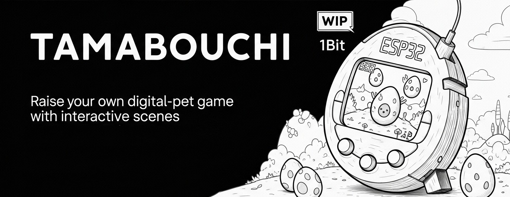

<p align="center">
  
</p>

<h1 align="center">TamaBouchi - A Retro Virtual Pet for ESP32</h1>

<p align="center">
  A Tamagotchi-like game for the ESP32. Raise your own digital pet with interactive scenes, mini-games, and a dynamic world!
</p>

<p align="center">
  <!-- BADGES - Replace with your actual URLs -->
  
  
  
</p>

---

## ✨ Features

TamaBouchi is more than just a simple virtual pet. It's a feature-rich experience powered by a custom game engine.

<p align="center">
  <!-- It's highly recommended to replace this with a GIF of your gameplay! -->
  
  <br/>
  <em>A peek at the TamaBouchi world!</em>
</p>

### Game & World
*   🥚 **Life Cycle:** Watch your pet hatch and grow, keeping track of stats like health, happiness, and hunger.
*   📜 **Story Mode:** An engaging prequel and tutorial sequence to introduce you to the world.
*   🕹️ **Action Menu:** Interact with your pet: Feed, Clean, Heal, Play, and tuck it into Sleep.
*   👾 **Flappy Tuck Mini-Game:** Jump in and play a fun mini-game to boost happiness!
*   🌦️ **Dynamic Weather System:** The world changes with Sunny, Cloudy, Rainy, Stormy, Snowy, and even Rainbow conditions.
*   🌍 **Living World:** Features like a particle system, screen effects (shake, fade), and animated background elements bring the world to life.

### Engine & System (EDGE)
*   ⚙️ **Custom Game Engine:** Built on "EDGE" (ESP32 Display Game Engine) for scene management, input handling, and rendering.
*   🎮 **Bluetooth Control:** Natively supports Bluetooth classic controllers via **Bluepad32**.
*   🌐 **Full Connectivity:**
    *   **OTA Updates:** Update your device wirelessly.
    *   **Web Serial Monitor:** A web-based interface for debugging and commands.
    *   **Web OLED Viewer:** See the device's screen mirrored in your browser!
*   🔋 **Power Saving:** Utilizes Deep Sleep functionality to save power.
*   💾 **Persistent State:** Your game progress is saved automatically.
*   🌐 **Localization:** Supports English and French.

---

## 🛠️ Hardware Requirements

You can build your own TamaBouchi device with standard components. The screen and buttons can even be virtualized using the Web OLED Viewer!

*   **ESP32** Development Board
*   **SSD1306** or **SH1106** OLED Display
*   Physical buttons for input (optional if using the web viewer or a Bluetooth controller)

---

## 🚀 Getting Started

This project is built for **PlatformIO**, so using VS Code with the PlatformIO extension is highly recommended.

1.  **Clone the Repository:**
    ```bash
    git clone https://github.com/benda95280/TamaBouchi.git
    cd TamaBouchi
    ```
2.  **Open in PlatformIO:** Open the cloned folder in VS Code. PlatformIO should automatically detect the project and prompt you to install the required Espressif 32 platform.
3.  **Check Dependencies:** PlatformIO will manage and install the library dependencies listed in `platformio.ini`.
4.  **Connect Hardware:** Wire up your ESP32, OLED display, and buttons according to your pin definitions.
5.  **Build & Upload:** Use the PlatformIO controls to build and upload the firmware to your ESP32.

---

## 🎮 How to Play

*   **Language Select:** On first boot, you'll be prompted to select a language.
*   **Prequel:** The game begins with a story sequence to get you started.
*   **Controls:** Use the physical buttons (Up, Down, OK) or connect a Bluetooth gamepad to interact with your pet.
*   **Web Interface:** Connect your computer or phone to the device's Wi-Fi to access OTA updates, the WebSerial monitor (`type 'help'` for commands), and the live OLED Screen Viewer.

---

## 🤝 Contributing

Contributions are what make the open-source community such an amazing place to learn, inspire, and create. Any contributions you make are **greatly appreciated**.

Please feel free to submit issues or pull requests!

---

## 📜 License

This project is licensed under the **GPL-3.0**. See the `LICENSE` file for more information.

The project relies on several third-party libraries, and their original licenses must be respected.

### Third-Party Libraries

| Library | Author | License |
| :--- | :--- | :--- |
| **ESP32-Game-Engine [EDGE]** | Nicolas Bourré | `MIT` |
| **MycilaWebSerial** | Mathieu Carbou | `GPL-3.0` |
| **U8g2 Library** | Oliver Kraus | `BSD 2-Clause` |
| **GEM Menu** | Armin Joachimsmeyer | `MIT` |
| **FastNoiseLite** | Auburn / Jordan Peck | `MIT` |
| **Bluepad32** | Ricardo Quesada | `Apache 2.0` |
| **ESPAsyncWebServer & AsyncTCP** | Hristo Gochkov | `LGPL-3.0` |
| **PrettyOTA** | Tomoyuki Furusawa | `MIT` |
| **ESPAsyncButton** | Ardestan | `MIT` |
